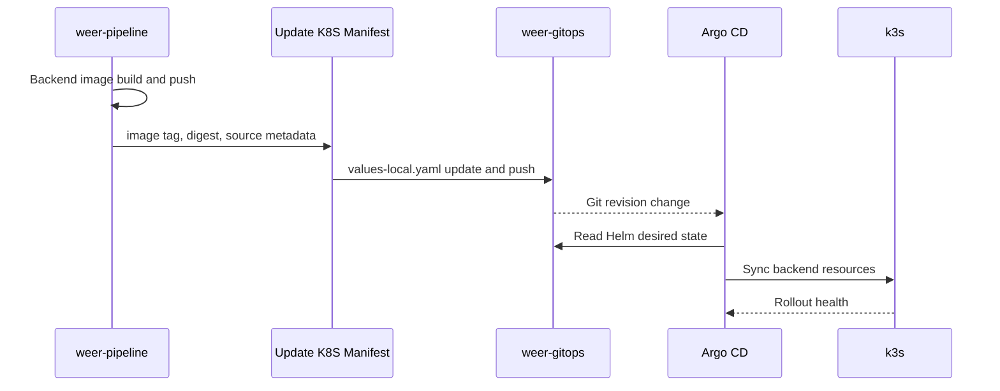

# WeER GitOps

言語: [한국어](README.ko.md) | [English](README.md) | 日本語

WeER GitOps は、WeER Renewal ポートフォリオプロジェクトの宣言的なデプロイリポジトリです。Backend の Helm chart と Argo CD Application を管理し、ローカルの k3s クラスターへ Backend を反映します。

## Pipeline と GitOps の境界

`weer-pipeline` はデリバリーアーティファクトを作成します。このリポジトリは Kubernetes の desired state を管理します。Backend イメージは Jenkins で build し、このリポジトリにはクラスターが実行すべきイメージを Git の変更として記録します。Argo CD はその変更を検知し、k3s に反映します。

Frontend の設定は意図的に含めていません。現在の Frontend は React の build 結果を S3 に upload し、必要に応じて CloudFront を invalidation する構成です。そのため、Kubernetes の Deployment、Service、Ingress をこの chart に置くと、実際の runtime architecture と一致しません。Frontend が Kubernetes ワークロードになった時点で再検討します。

## 全体フロー



MVP の更新対象は `charts/weer/values-local.yaml` です。Commit message には source commit と upstream Jenkins URL を残し、どの build からデプロイが始まったか追跡できるようにしています。ローカル環境の Argo CD Application は automated sync と self-heal を使用します。

## 設計上の意見と判断

1. GitOps はアプリケーションを compile する場所ではなく、望ましいデプロイ状態を管理する場所としました。イメージ作成は Jenkins の責任であり、このリポジトリはクラスターが実行するイメージを記録します。
2. downstream update job によって CI と GitOps の契約を明確にしました。`wait: false` により build がクラスター同期の時間に依存しません。運用環境では二つの Job を関連付ける監視が必要です。
3. Helm で共通 template と環境別 values を分けました。現在の chart には、実際に検証する対象である Backend だけを含めています。
4. Monitoring の values は拡張ポイントとして残していますが、Prometheus/Grafana が構築済みだとは主張していません。次の段階で metrics、alert rule、障害と復旧の検証を追加します。
5. ローカル環境では削除動作を慎重に扱うため `prune: false` を使用しています。リソースの所有権と削除ポリシーを検証した後、環境ごとに厳格な設定を検討できます。

## リポジトリ構成

```text
.
├── apps/argocd/weer-local.yaml
├── charts/weer/
│   ├── Chart.yaml
│   ├── values.yaml
│   ├── values-local.yaml
│   └── templates/
├── docs/
└── scripts/update-image-tag.sh
```

## 検証コマンド

```bash
helm template weer charts/weer -f charts/weer/values-local.yaml
bash -n scripts/update-image-tag.sh
kubectl get application -n argocd
kubectl get deploy,svc,ingress -n weer
```

最初の二つは静的検証で、後ろの二つには稼働中の k3s と Argo CD が必要です。レジストリ、hostname、credential は実環境を接続するときに設定する placeholder として残しています。
