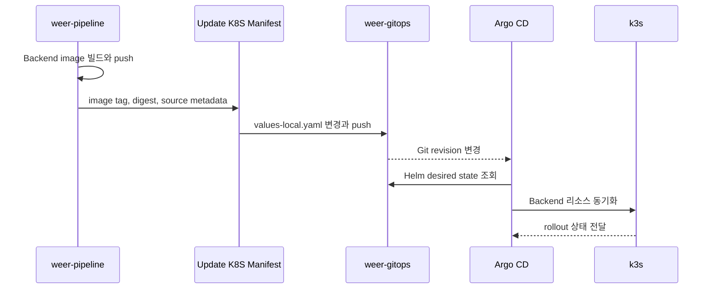

# WeER GitOps

언어: [한국어] | [English](README.md) | [日本語](README.ja.md)

WeER GitOps는 WeER Renewal 포트폴리오 프로젝트의 선언적 배포 저장소다. Backend Helm chart와 Argo CD Application을 관리하고, 로컬 k3s 클러스터에 Backend를 반영한다.

## Pipeline과 GitOps의 경계

`weer-pipeline`은 배포 아티팩트를 만든다. 이 저장소는 Kubernetes가 원하는 상태를 관리한다. Backend 이미지는 Jenkins에서 빌드하고, 이 저장소에는 클러스터가 실행해야 할 이미지가 Git 변경으로 기록된다. Argo CD는 그 변경을 감지해 k3s에 반영한다.

Frontend 설정은 의도적으로 넣지 않았다. 현재 Frontend는 React build 결과물을 S3에 업로드하고 필요할 때 CloudFront를 무효화하는 구조다. 따라서 Kubernetes Deployment, Service, Ingress를 이 chart에 남기면 실제 런타임 구조와 문서가 달라진다. Frontend가 Kubernetes 워크로드가 되는 시점에 다시 판단한다.

## 전체 흐름



MVP의 변경 대상은 `charts/weer/values-local.yaml`이다. Commit message에는 source commit과 upstream Jenkins URL을 남겨 배포가 어떤 빌드에서 시작됐는지 추적할 수 있게 했다. 로컬 환경의 Argo CD Application은 automated sync와 self-heal을 사용한다.

## 설계 과정에서의 의견

1. GitOps는 애플리케이션을 컴파일하는 곳이 아니라 원하는 배포 상태를 관리하는 곳으로 두었다. 이미지 생성은 Jenkins의 책임이고, 이 저장소는 클러스터가 실행할 이미지 정보를 기록한다.
2. downstream update job을 두어 CI와 GitOps 사이의 계약을 분명히 했다. `wait: false`로 빌드가 클러스터 동기화 시간에 묶이지 않게 했으며, 운영 환경에서는 두 Job을 연결해 추적할 모니터링이 필요하다.
3. Helm으로 공통 template과 환경별 값을 분리했다. 현재 chart는 실제로 검증할 대상인 Backend만 포함한다.
4. Monitoring 값은 확장 지점으로 남겨두었지만 Prometheus/Grafana가 구축됐다고 주장하지 않는다. 다음 단계에서 metrics, alert rule, 장애와 복구 검증을 추가한다.
5. 로컬 환경에서는 `prune: false`를 사용해 삭제 동작을 보수적으로 제한했다. 리소스 소유권과 삭제 정책을 검증한 뒤 환경별로 더 엄격한 정책을 적용할 수 있다.

## 저장소 구조

```text
.
├── apps/argocd/weer-local.yaml
├── charts/weer/
│   ├── Chart.yaml
│   ├── values.yaml
│   ├── values-local.yaml
│   └── templates/
├── docs/
└── scripts/update-image-tag.sh
```

## 검증 명령

```bash
helm template weer charts/weer -f charts/weer/values-local.yaml
bash -n scripts/update-image-tag.sh
kubectl get application -n argocd
kubectl get deploy,svc,ingress -n weer
```

앞의 두 명령은 정적 검증이고, 뒤의 명령은 실행 중인 k3s와 Argo CD가 필요하다. 레지스트리, hostname, credential은 실제 환경을 연결할 때 채울 placeholder로 남겨두었다.
