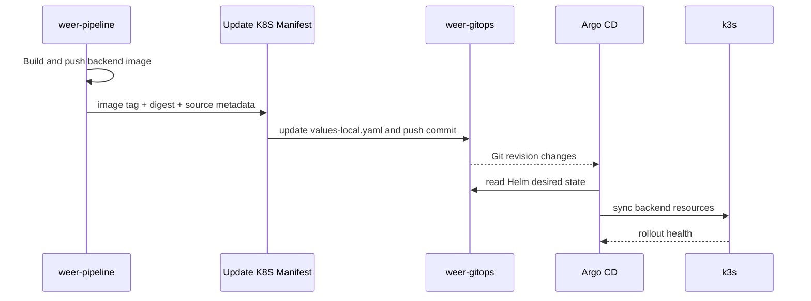

# WeER GitOps

Language: [한국어](README.ko.md) | English | [日本語](README.ja.md)

WeER GitOps is the declarative deployment repository for the WeER Renewal portfolio project. It stores the backend Helm chart and Argo CD application used to reconcile the backend into a local k3s cluster.

## Why This Boundary?

`weer-pipeline` is responsible for producing and publishing delivery artifacts. This repository is responsible for the desired Kubernetes state. A backend image is promoted by a Git change, and Argo CD turns that reviewed state into a cluster rollout.

The frontend is intentionally absent from this chart. Its current deployment model is React build -> S3 -> optional CloudFront invalidation, so keeping frontend Deployment, Service, and Ingress resources here would make the repository describe the wrong runtime architecture. It can be reconsidered later if the frontend becomes a Kubernetes workload.

## End-to-End Connection



The update target in the MVP is `charts/weer/values-local.yaml`. The commit preserves the source commit and upstream Jenkins URL in its message so that a deployment can be traced back to a build. `Argo CD` is configured with automated sync and self-heal for the local environment.

## Design Discussion

The current design reflects several opinions and trade-offs:

1. GitOps should own desired state, not application compilation. The image is built in Jenkins; this repository records which image the cluster should run.
2. A downstream update job creates a clear integration contract between CI and GitOps. It is asynchronous (`wait: false`) so the build is not coupled to the full cluster reconciliation time. Monitoring must therefore correlate upstream and downstream jobs.
3. Helm is used to keep environment values separate from reusable templates. The current chart is backend-only because that is the verified MVP deployment boundary.
4. Monitoring values are reserved in the chart, but no Prometheus/Grafana deployment is claimed yet. The next layer should add service metrics, alert rules, and evidence from a real failure/recovery exercise.
5. `prune: false` is a cautious local default. A later environment can adopt stricter pruning after ownership and deletion behavior are tested.

## Repository Layout

```text
.
├── apps/argocd/weer-local.yaml
├── charts/weer/
│   ├── Chart.yaml
│   ├── values.yaml
│   ├── values-local.yaml
│   └── templates/
├── docs/
│   ├── gitops-update-flow.md
│   ├── k3s-argocd-setup.md
│   ├── rollback-runbook.md
│   └── sensitive-values.md
└── scripts/update-image-tag.sh
```

## Verification Checklist

```bash
helm template weer charts/weer -f charts/weer/values-local.yaml
bash -n scripts/update-image-tag.sh
kubectl get application -n argocd
kubectl get deploy,svc,ingress -n weer
```

The first two checks are local/static validation. The Kubernetes checks require a running k3s and Argo CD environment. Placeholders remain for the registry, hostname, and credentials until that environment is connected.
